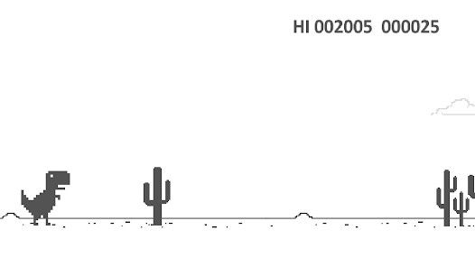

# Google Chrome T-Rex Game: The Offline Dinosaur Adventure

## Introduction
The Google Chrome T-Rex game, affectionately known as the "Chrome Dino," is a simple yet addictive browser game that activates when the internet connection is lost.

Created by Google developers in 2014, this game has become a surprising fan favorite, offering endless hours of entertainment during connectivity downtimes.

---

## Gameplay Mechanics
The T-Rex game is a side-scrolling endless runner. Players control a pixelated T-Rex running through a desert, dodging cacti and pterodactyls by jumping and ducking. The goal is to achieve the highest score possible before colliding with an obstacle. The game speeds up as time progresses, increasing the challenge.

---

## Origins and Development
The Chrome Dino game was designed to commemorate the prehistoric era when there was no internet. According to Google, the concept behind the game aligns with the idea of being “offline” in a fun, nostalgic way. It was coded by Google Chrome developers Sebastien Gabriel, Alan Bettes, and Edward Jung.

---

## Popularity and Hidden Features
While initially designed as a quick offline pastime, the T-Rex game has grown into an internet sensation. Players can access the game even with an active connection by typing `chrome://dino` into the browser's address bar. Additionally, the game features fun Easter eggs, such as a night mode after 700 points.

---

## Fun Facts
- The game was nicknamed “Project Bolan” as a tribute to Marc Bolan, the lead singer of T. Rex.
- Since its release, it has been played over 270 million times each month globally.
- The highest possible score is 99,999, after which the game resets.

---

## Key Game Features

| **Feature**           | **Details**                          |
|-----------------------|--------------------------------------|
| **Release Year**      | 2014                                |
| **Developer**         | Google Chrome Team                  |
| **Platform**          | Google Chrome Browser               |
| **Game Mode**         | Endless Runner                      |
| **Accessibility**     | Offline or `chrome://dino`          |

---

## Learn More
- [Official Chrome Dino Game on Google](https://chromedino.com)
- [Chrome Dino on Wikipedia](https://en.wikipedia.org/wiki/Dinosaur_Game)

---
