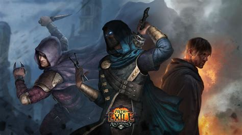

# **Path of Exile: A Journey Through Wraeclast**

## **Introduction to Path of Exile**
Path of Exile (PoE) is an action role-playing game (ARPG) developed and published by Grinding Gear Games. Set in the dark fantasy world of Wraeclast, players embark on epic journeys, facing countless enemies, mastering skills, and uncovering lore-rich stories. Renowned for its complex gameplay systems and expansive content, PoE has become a hallmark of modern ARPGs.

## **Gameplay Mechanics**
The game offers a deep and intricate gameplay system centered around character builds, skill customizations, and challenging combat. Path of Exile stands out for its **Passive Skill Tree**, an enormous web of interconnected nodes that allow players to develop highly specialized characters. Additionally, the use of skill gems provides unique abilities, making every build feel personal and distinct.

## **The World of Wraeclast**
Wraeclast is a forsaken land filled with mystery, danger, and remnants of ancient civilizations. Players traverse haunting landscapes, including desolate beaches, ancient ruins, and treacherous forests. Each area is filled with detailed lore, creating an immersive world that challenges both strategy and bravery.

## **Endgame Content**
One of Path of Exile's biggest attractions is its **endgame system**, known as the Atlas of Worlds. This mechanic lets players explore an infinite array of maps, each offering unique challenges and rewards. Whether you are fighting through hordes of enemies or confronting powerful bosses, the endgame ensures lasting replayability.

## **Community and Economy**
The game boasts an active and vibrant community. Its **player-driven economy** revolves around bartering with items, such as orbs and crafting materials, rather than traditional currency. This unique system fosters interaction and strategic trading between players, contributing to its rich multiplayer experience.

---

## **Helpful Resources**
1. [Path of Exile Official Website](https://www.pathofexile.com)
2. [Path of Exile Wiki](https://pathofexile.fandom.com)

---

## **Table: Key Features of Path of Exile**
| Feature              | Description                                                             |
|----------------------|-------------------------------------------------------------------------|
| Developer            | Grinding Gear Games                                                   |
| Release Date         | October 23, 2013                                                      |
| Genre                | Action Role-Playing Game (ARPG)                                       |
| Platforms            | PC, PlayStation, Xbox                                                |
| Unique Selling Point | Free-to-play with deep customization and a rich, ever-expanding world |

---
